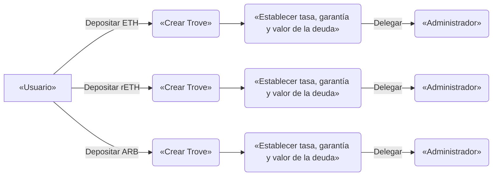

# Préstamos y liquidaciones

### ¿Qué hace que los préstamos en Nerite sean tan únicos?

Nerite permite a los usuarios pedir prestada la moneda estable USND en sus propios términos. Los prestatarios pueden elegir y ajustar la tasa que están dispuestos a pagar por sus préstamos. Los prestatarios pueden elegir pagar un 0 %, un 5 %, un 20 %, etc. Los prestatarios establecerán las tasas de mercado de acuerdo con su tolerancia al riesgo individual, sin depender de la gobernanza ni de la gestión algorítmica de las tasas. Cada garantía también tiene su propio mercado de préstamos, lo que permite que se desarrolle un mercado de tasas.

Todo esto da lugar a una experiencia de préstamo altamente eficiente en términos de capital, segura y descentralizada.

### ¿Qué es un Trove?

Cuando un prestatario deposita una garantía (ETH, rETH, ARB, etc.), se crea un Trove (posición de préstamo individual, también llamado 'Trove').
Un **Trove** es la versión de Nerite de una «caja fuerte» o posición individual de préstamo. Cada Trove tiene un propietario de dirección Ethereum concreto, y cada propietario puede tener varios Troves.

Cada Trove solo puede tener un tipo de garantía depositada en él.

Cada Trove le permite gestionar un préstamo, ajustando los valores de la garantía y la deuda según sea necesario, así como establecer su propia tasa de interés. La gestión de Trove puede delegarse opcionalmente a un «gestor» al que se le otorgan permisos especiales. 

Los Troves también son NFT (tokens no fungibles) transferibles y se pueden encontrar en la cartera del propietario. Tenga cuidado con esto: al transferir el NFT también se transfiere la propiedad de la posición.

### ¿Qué tipos de garantías puedo utilizar en Nerite?

Nerite trabaja con las siguientes diez garantías:
- WETH (Ethereum envuelto)
- wstETH (Lido ETH envuelto)
- rETH (Rocket pool ETH)
- rsETH (Kelp ETH)
- weETH (Etherfi ETH)
- tETH (Treehouse ETH)
- ARB (Arbitrum) 
- COMP (Compound Finance)
- tBTC (Threshold Bitcoin)

:::tip
No se pueden añadir nuevos tipos de garantías. Sin embargo, las existentes se pueden eliminar o volver a añadir en función de los factores de riesgo. 
:::

### ¿Existe una deuda mínima?

Sí, se requiere una deuda mínima de 500 USND para poder solicitar un préstamo.

### **¿Cuándo tengo que devolver mi préstamo?**

Los préstamos emitidos por el protocolo no tienen un calendario de amortización. Puedes dejar tu Trove abierto y devolver tu deuda en cualquier momento, siempre y cuando mantengas una relación préstamo-valor (LTV) saludable.

### ¿Hay un periodo de bloqueo? 

No hay periodo de bloqueo. Los usuarios son libres de retirar sus depósitos de garantía cuando lo deseen. 
Como excepción, los retiros de los prestatarios se suspenden temporalmente si el LTV total de un mercado de préstamos supera el 75 %.

### ¿Cómo decido mi LTV?

Esto depende de tus preferencias personales, principalmente de tu tolerancia al riesgo y de la actividad con la que quieras gestionar tu(s) posición(es). Para ayudarte a tomar la decisión, encontrarás opciones preestablecidas en la interfaz de usuario que pueden servirte de guía.

:::tip
Es posible que mostremos BOLD en lugar de USND en varios gráficos que hemos tomado prestados de Liquity.
:::

Tenga en cuenta que estos ejemplos son solo ilustrativos y no representan umbrales definitivos de riesgo o seguridad. Es esencial que determine su propia tolerancia al riesgo y su nivel de comodidad como usuario.

Si su LTV se vuelve demasiado alto, su posición será liquidada.
> LTV = Préstamo sobre valor Un LTV del 50 % significa que si pidió prestados 100 $, su garantía es de 200 $.

### ¿Cómo funcionan las liquidaciones en Nerite?

Las posiciones (Troves) se liquidan si el LTV supera el valor máximo.

Nerite utiliza los fondos de estabilidad como su principal mecanismo de liquidación para absorber la deuda y las garantías liquidadas. Cada mercado de préstamos tiene su propio fondo de estabilidad dedicado que obtiene ganancias por liquidación (en la garantía respectiva) a cambio de quemar deuda. Eso significa que los depositantes del fondo de estabilidad ganan el 100 % de las comisiones de las liquidaciones del protocolo y obtienen esas comisiones en la garantía liquidada (por ejemplo, ETH).

Las liquidaciones justo a tiempo y la redistribución de la deuda y la garantía entre los prestatarios del mismo mercado gestionan las liquidaciones como último recurso si el fondo de estabilidad se quedara vacío.

Un prestatario liquidado suele incurrir en una penalización del 5 % y podrá reclamar la garantía restante después de la liquidación.

Un caso especial es cuando es necesaria una redistribución, entonces:

* Para ETH, la pérdida asciende al 10 % de la deuda (como máximo). Eso corresponde a una pérdida máxima del 9,09 % expresada en términos de garantía.
* Para rETH/wstETH, la pérdida es del 20 % de la deuda, lo que corresponde a una pérdida máxima del 16,67 % expresada en términos de garantía.

### ¿Cómo se me compensa por liquidar un Trove? 

La liquidación de Troves está relacionada con ciertos costes de gas que debe cubrir el iniciador. El protocolo ofrece una compensación por gas según la siguiente fórmula:

`0,0375 WETH + min(0,5 % trove_collateral, 2_units_of_LST_or_WETH)`

El `0,0375 WETH` se financia mediante un [depósito de gas reembolsable](borrowing-and-liquidations.md#what-is-the-refundable-gas-deposit), mientras que la parte variable `0,5 %` proviene de la garantía liquidada, lo que reduce ligeramente la ganancia por liquidación para los proveedores de estabilidad.

### ¿Cuál es el máximo Loan-To-Value (LTV)?

Eso depende del tipo de garantía que utilices.&#x20;

ETH tendrá un LTV del 90,91 %, mientras que wstETH y rETH tendrán un LTV del 83,33 %.

### ¿Qué es el depósito de gas reembolsable?

Para abrir un nuevo Trove, el protocolo requiere una reserva de liquidación de 0,0375 ETH, independientemente de la garantía elegida, que se reserva para cubrir los costes de gas de una posible liquidación. El depósito se devuelve cuando el usuario cierra el Trove (incluido en caso de reembolsos).

### ¿Cuánto pagaré por mi préstamo?

En Liquity V2 no hay comisiones por adelantado. En su lugar, se pagan intereses de forma continua, lo que lo hace adecuado también para préstamos a corto plazo.

Los intereses que se pagan se determinan según el tipo de interés que se establezca. Por ejemplo, si se piden prestados 10 000 USND a un tipo de interés del 5 %, se pagarán unos 500 USND en concepto de intereses al cabo de un año. Estos intereses se añaden a la deuda pendiente.

### ¿Qué son los tipos establecidos por el usuario?

En Nerite *y Liquity V2*, los usuarios pueden establecer sus propios tipos de interés, lo que les da un control total sobre los costes y mejora la previsibilidad. Esta característica permite adaptarse a diversas condiciones del mercado y ayuda a estabilizar la paridad del USND.

Los tipos de interés establecidos por el usuario facilitan un equilibrio eficiente en términos de capital entre los prestatarios y los titulares de USND de una manera totalmente impulsada por el mercado. Además, estas tasas sirven como la principal fuente de ingresos para los titulares de USND, generando un rendimiento real continuo y sostenible para los depositantes y proveedores de liquidez de USND.

Los prestatarios deben establecer sus tasas en función de su tolerancia al riesgo de [rescate](/docs/user-docs/redemption-and-delegation#what-are-redemptions).

Más información sobre cómo establecer sus tasas [aquí](https://www.liquity.org/blog/interest-rate-management-in-liquity-v2).

### ¿Puedo ajustar la tasa?

Sí, siempre puede ajustar su tasa de interés en cualquier momento. Dado que usted, como usuario, puede establecer su propia tasa de interés, tiene plena autonomía sobre los costos de sus préstamos.

Sin embargo, ten en cuenta que se cobra una comisión correspondiente a 7 días de interés medio al abrir el préstamo, así como por cualquier ajuste de la tasa que se produzca menos de 7 días después del último ajuste. Sin ella, los prestatarios con tasas de interés bajas podrían evadir los reembolsos intercalando una transacción de reembolso con un ajuste de la tasa de interés tanto al alza como a la baja, lo que a su vez dirigiría indebidamente el reembolso hacia los prestatarios con tasas de interés más altas.

### ¿Cómo puedo decidir cuál es el tipo adecuado para mí?

El establecimiento de un tipo de interés determina el riesgo de reembolso del usuario y debe estar en consonancia con sus objetivos y con el grado de actividad con el que desea gestionar su posición.

Los usuarios también pueden decidir delegar la gestión de los tipos de interés a un tercero, que puede fijar su tipo de interés y cobrar una comisión por este servicio (véase [enlace](/docs/user-docs/redemption-and-delegation#what-is-delegation-of-interest-rates)).

Si opta por gestionar su propio tipo, tendrá que sopesar el ahorro que supone un tipo más bajo frente al mayor riesgo de rescate y la mayor frecuencia de ajuste, con los posibles costes adicionales que ello conlleva (comisiones por ajuste prematuro y costes de gas).

Dado que los reembolsos se realizan en orden ascendente de tipo de interés (para el activo colateral correspondiente), lo normal es que desee mantener un margen de otros prestatarios con tipos más bajos por delante de usted. Elegir tipos más altos puede aumentar los costes recurrentes de su préstamo, pero le dará tranquilidad ante fluctuaciones inesperadas del mercado.

Puede ver la distribución de las tasas de otros usuarios en un histograma y posicionarse en consecuencia.

Los reembolsos suelen producirse cuando USND cotiza por debajo de 1 dólar menos la comisión de reembolso actual. Estar atento a la [actividad de reembolso](https://dune.com/liquity/liquity-v2#redemptions) pasada puede ayudarle a evaluar el riesgo general de reembolso, lo que le servirá como dato adicional para seleccionar el tipo de interés.

En general, aquellos que estén dispuestos a supervisar activamente sus posiciones o a pedir préstamos por periodos más cortos pueden optar por tasas más bajas. Por el contrario, los usuarios que optimicen para una posición más pasiva y a largo plazo se beneficiarán más de establecer una tasa de interés relativa más alta.

### ¿Cuál podría ser el tipo de interés medio?

Estos tipos serán fijados de forma continua por el mercado y variarán con el tiempo. Esperamos que, en promedio, los tipos sean similares a los de los préstamos en Sky o Aave utilizando ETH o ETH apostado. Sin embargo, debido a la flexibilidad de los tipos fijados por los usuarios, es posible que algunos usuarios paguen tipos significativamente más bajos durante determinados periodos.

Dado que el 75 % de los ingresos por intereses se paga directamente a los depositantes de USND, esperamos además que los rendimientos de los depósitos de stablecoins sean comparables, si no superiores, a los que ofrecen los CDP y los mercados de préstamos de la competencia. Gracias al atractivo de USND y suponiendo la aparición de casos de uso externos (prima monetaria), esto podría dar lugar a tasas de préstamo más bajas en general que las ofrecidas por otras plataformas. Obtenga más información sobre el diferencial entre prestatarios y prestamistas en nuestro [artículo](https://www.liquity.org/blog/liquity-v2-a-de-facto-reference-rate-for-defi).

### ¿Qué determina el riesgo de mi Trove?

Hay dos parámetros clave a tener en cuenta:

* **Relación préstamo-valor (LTV)**: se basa en su ratio deuda-garantía y afecta a su riesgo de [liquidación](borrowing-and-liquidations.md#how-do-liquidations-work-in-nerite).
* **Tasa de interés (IR)**: tú mismo estableces esta tasa, y afecta a tu riesgo de ser [rescatado](/docs/user-docs/redemption-and-delegation#what-are-redemptions).

Tienes la flexibilidad de establecer estos parámetros como mejor te parezca, lo que te permite controlar el riesgo relativo de cada Trove. Puedes crear varios Troves con la misma dirección, lo que te permite gestionar diferentes perfiles de riesgo para diferentes partes de tu cartera.

### ¿Hay algún otro cargo relacionado con el préstamo?

Para impedir las estrategias de evasión del rescate de Trove, en las que los prestatarios intentan minimizar sus pagos de intereses de manera desleal, se cobra una pequeña «comisión por ajuste prematuro» sobre los cambios en los tipos de interés que se producen en menos de 7 días desde el último ajuste (o la apertura del Trove). La comisión por ajuste prematuro es igual a 7 días de interés medio en el mercado de préstamos correspondiente. Tenga en cuenta que esta comisión difiere del tipo de interés establecido por el usuario.&#x20;

La comisión se denomina en UDSN y se añade a la deuda del Trove. Se cobra la misma comisión cuando se abre un nuevo Trove o cuando se aumenta su deuda (solo afecta a la deuda añadida).

### ¿Cuántos Troves (préstamos) puedo abrir con la misma dirección?

Puede tener varios Troves abiertos para la misma garantía o para diferentes tipos de garantía, todos ellos representados como NFT independientes.

### ¿Son transferibles los Troves?

Sí, se representan como NFT (ERC-721), por lo que se pueden transferir fácilmente entre carteras. Cuando envía el NFT, también envía el acceso completo a su Trove y a todos los fondos que contiene.

Ten en cuenta que las estrategias más avanzadas, como «vender» Troves en mercados secundarios como OpenSea, conllevan riesgos inherentes, por lo que se recomienda precaución.

### ¿Cómo puedo repetir mi exposición?

El looping (repetición de exposición apalancada) le permite pedir prestado USND contra su garantía depositada (ETH, wstETH o rETH) y utilizarlo para comprar más garantía, aumentando su exposición al subyacente. Liquity V2 viene con automatización incorporada para lograrlo con un solo clic (zappers).&#x20;

Asegúrate de elegir una interfaz que admita esta funcionalidad y ten en cuenta la liquidez/deslizamiento.

### ¿Cómo se mitigan los riesgos de las garantías?

Liquity V2 tendrá tres mercados de préstamos separados para los diferentes tipos de garantías con sus propios  fondos de estabilidad (para liquidaciones eficientes), tipos de interés establecidos por el usuario y factores LTV para sus respectivos activos (ETH, wstETH y rETH). 

Nerite tendrá esos tres más las garantías adicionales mencionadas anteriormente, pero todas seguirán los mismos patrones inmutables.

Los riesgos se mitigan mediante restricciones temporales de préstamo en momentos de baja colateralización de un mercado determinado, una lógica de rescate que da prioridad a las garantías con menos respaldo del fondo de estabilidad y un cierre de garantías como medida de emergencia para mantener el equilibrio del sistema y protegerlo contra la inestabilidad del mercado.

Hay que tener en cuenta que, a pesar de todas estas medidas, el USND sigue dependiendo de los tres activos de garantía mencionados y no hay una garantía estricta de que siga estando sobrecolateralizado en caso de un colapso repentino de un activo de garantía.

### ¿Cómo distribuye el sistema el riesgo entre los diferentes LST? 

Esto depende de la parte en cuestión:

* Prestatarios: El riesgo colateral se limita al activo colateral en poder del prestatario. Un prestatario no se ve afectado negativamente por el incumplimiento de otro activo colateral.
* Titulares de USND: como moneda estable con múltiples garantías, USND depende de la liquidación efectiva de los préstamos con garantía insuficiente en todos los mercados de préstamos para mantener un exceso de garantía. Los titulares están sujetos a los riesgos de todos los activos de garantía admitidos.
* Ganadores: los depositantes del fondo de estabilidad solo están expuestos al activo que han elegido. Sin embargo, como titulares de USND, se ven igualmente afectados por una posible desvinculación.

### ¿Qué mecanismos se aplican si el Stability Pool está vacío?

Si el Stability Pool no cubre la totalidad de la deuda y se vacía por completo debido a la liquidación, el sistema recurre a los siguientes modos de liquidación.

El liquidador puede elegir libremente entre dos modos de liquidación de reserva para la deuda que exceda los fondos del Stability Pool:

1. Liquidación justo a tiempo (JIT): el liquidador envía una cantidad de USND correspondiente a la deuda (restante) a cambio del 105 % de su valor nominal en ETH (apostado).
2. Redistribución: el liquidador activa una redistribución, mediante la cual toda la deuda y la garantía de Trove se redistribuyen entre todos los demás prestatarios del mercado de garantías correspondiente, en proporción a sus propias cantidades de garantía. De este modo, los respectivos prestatarios recibirán una parte de la garantía liquidada y verán aumentar sus deudas de forma proporcional.

### Cierre de los mercados de préstamos
El sistema puede cerrar los mercados de préstamos cuya ratio de colateralización total (TCR) sea inferior al 110 % (para ETH) o al 120 % (para wstETH y rETH). El cierre se lleva a cabo incentivando los reembolsos contra la garantía respectiva (véase [esto](https://liquity.gitbook.io/v2-whitepaper/liquity-v2-whitepaper/functionality-and-use-cases#c9aukpugrj32) para más detalles).